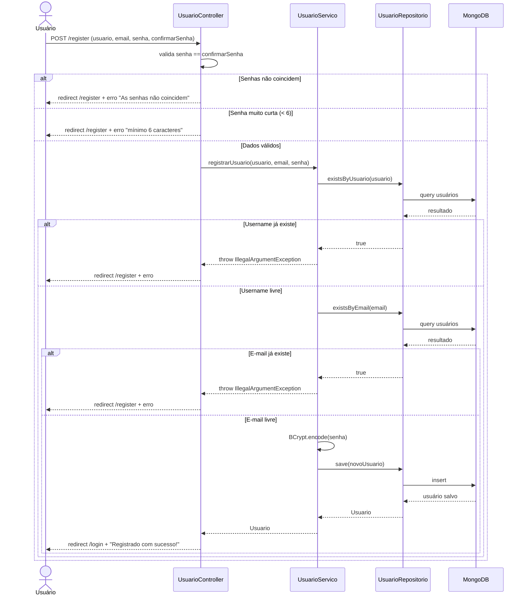
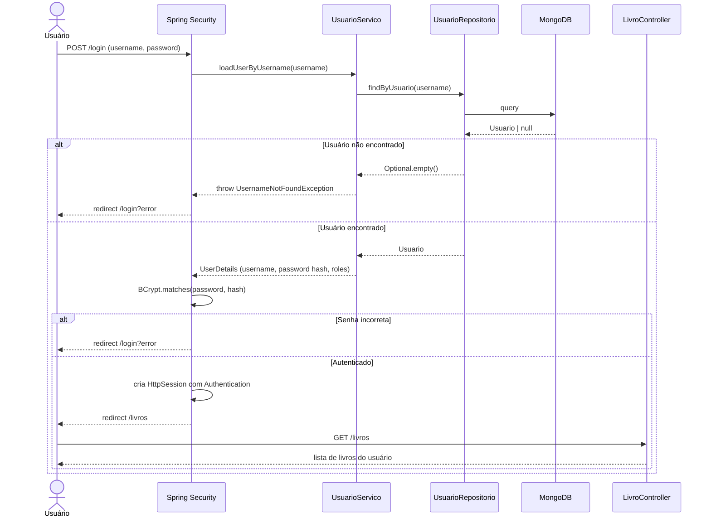
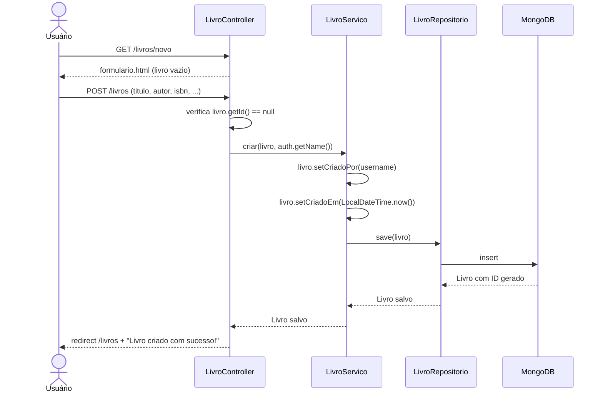
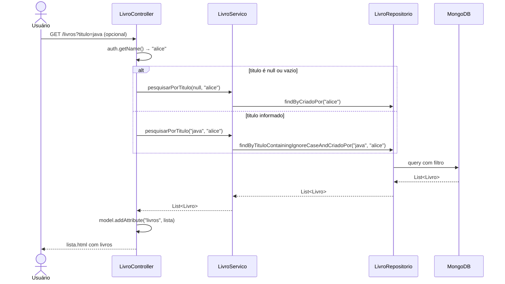
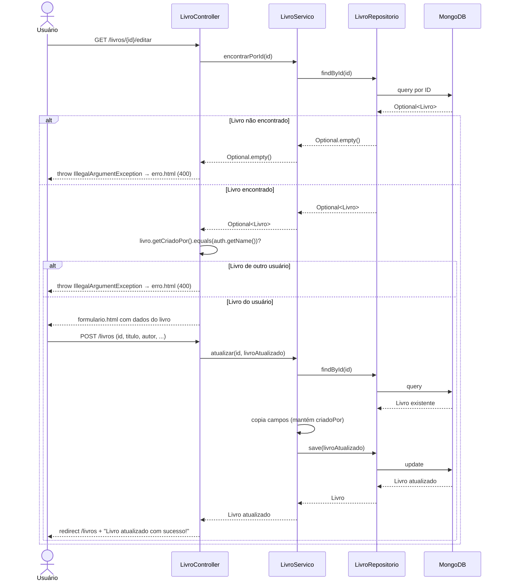
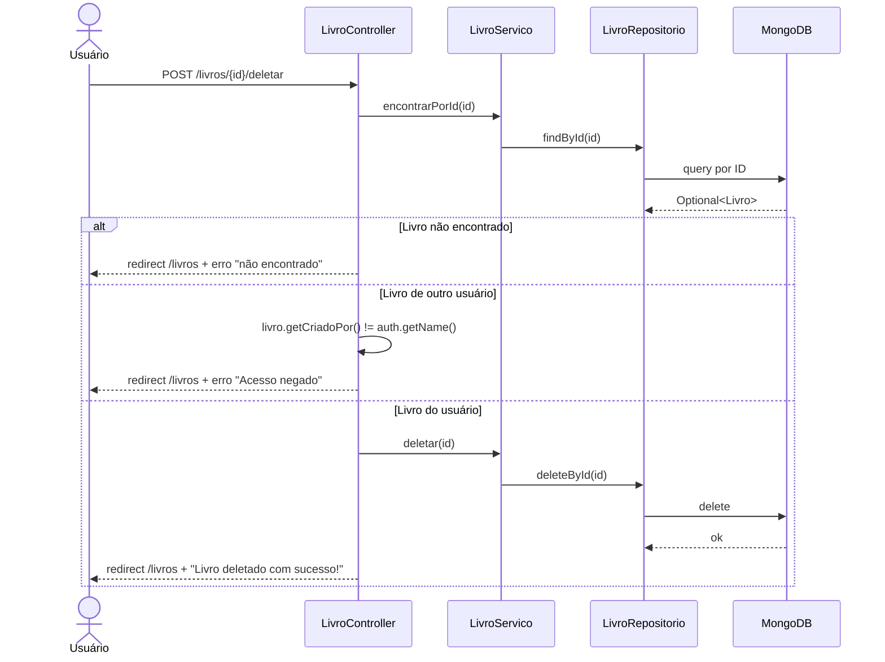

# RTM — Matriz de Rastreabilidade de Requisitos
## Gerenciador de Biblioteca Pessoal

> Cada requisito funcional está mapeado ao(s) teste(s) correspondente(s), garantindo 100% de rastreabilidade.

---

## RF01 — Cadastro de Usuário

**Descrição:** O sistema deve permitir que um novo usuário se registre informando nome de usuário, e-mail e senha. O sistema deve validar duplicidade de username e e-mail, e criptografar a senha antes de persistir.

| Critério de Aceite | Classe de Teste | Método | Tipo |
|--------------------|----------------|--------|------|
| Registrar usuário com senha criptografada | `UsuarioServicoTest` | `shouldRegisterUserWithEncodedPassword` | Integração |
| Lançar exceção ao username duplicado | `UsuarioServicoTest` | `shouldThrowExceptionWhenUsernameAlreadyExists` | Caixa Branca |
| Lançar exceção ao e-mail duplicado | `UsuarioServicoTest` | `shouldThrowExceptionWhenEmailAlreadyExists` | Caixa Branca |
| Persistir usuário no MongoDB | `UsuarioServicoTest` | `shouldPersistUserInMongoDB` | Integração |
| Formulário de registro renderiza | `UsuarioControllerTest` | `shouldShowRegistrationForm` | Caixa Preta |
| Registro via POST redireciona para login | `UsuarioControllerTest` | `shouldRegisterUserAndRedirectToLogin` | Caixa Preta |
| Senhas divergentes retornam erro | `UsuarioControllerTest` | `shouldRejectRegistrationWhenPasswordsMismatch` | Caixa Preta |
| Múltiplos cenários de validação de senha | `UsuarioControllerTest` | `shouldRejectShortPasswords` | Parametrizado |

### Diagrama UML de Sequência — RF01: Cadastro de Usuário

---

## RF02 — Autenticação (Login / Logout)

**Descrição:** O sistema deve autenticar usuários com username e senha via formulário. Sessão deve ser gerenciada pelo Spring Security.

| Critério de Aceite | Classe de Teste | Método | Tipo |
|--------------------|----------------|--------|------|
| Página de login renderiza | `UsuarioControllerTest` | `shouldShowLoginPage` | Caixa Preta |
| Página de login com erro renderiza | `UsuarioControllerTest` | `shouldShowLoginPageWithError` | Caixa Preta |
| Página de login com logout renderiza | `UsuarioControllerTest` | `shouldShowLoginPageAfterLogout` | Caixa Preta |
| Spring Security carrega UserDetails | `UsuarioServicoTest` | `shouldLoadUserDetailsByUsername` | Integração |
| Rota protegida redireciona anônimo | `LivroControllerTest` | `shouldRedirectUnauthenticatedUserToLogin` | Caixa Preta |

### Diagrama UML de Sequência — RF02: Autenticação

---

## RF03 — Criação de Livro

**Descrição:** O usuário autenticado deve poder cadastrar um novo livro informando título, autor, ISBN, editora, ano, gênero e descrição.

| Critério de Aceite | Classe de Teste | Método | Tipo |
|--------------------|----------------|--------|------|
| Criar livro com dono e timestamp | `LivroServicoTest` | `shouldCreateBookWithOwnerAndTimestamp` | Integração |
| Formulário novo livro renderiza | `LivroControllerTest` | `shouldShowNewBookForm` | Caixa Preta |
| POST cria livro e redireciona | `LivroControllerTest` | `shouldCreateBookAndRedirect` | Caixa Preta |
| Criar livros com múltiplos títulos | `LivroServicoTest` | `shouldCreateBooksWithDifferentTitles` | Parametrizado |

### Diagrama UML de Sequência — RF03: Criação de Livro

---

## RF04 — Listagem e Busca de Livros

**Descrição:** O usuário deve visualizar apenas seus próprios livros. Deve ser possível filtrar por título (case insensitive).

| Critério de Aceite | Classe de Teste | Método | Tipo |
|--------------------|----------------|--------|------|
| Listar apenas livros do usuário | `LivroServicoTest` | `shouldListOnlyBooksOfCurrentUser` | Integração |
| Buscar por título case-insensitive | `LivroServicoTest` | `shouldSearchBooksByTitleCaseInsensitive` | Integração |
| Retornar todos quando filtro vazio | `LivroServicoTest` | `shouldReturnAllBooksWhenFilterIsBlank` | Caixa Branca |
| Buscar por título no repositório | `LivroRepositorioTest` | `shouldSearchByTitleIgnoreCase` | Integração |
| Listar por dono no repositório | `LivroRepositorioTest` | `shouldFindBooksByOwner` | Integração |
| Página de lista renderiza | `LivroControllerTest` | `shouldListBooksForAuthenticatedUser` | Caixa Preta |
| Busca por título via GET | `LivroControllerTest` | `shouldSearchBooksByTitle` | Caixa Preta |
| Múltiplos usuários isolados | `LivroServicoTest` | `shouldIsolateBooksBetweenUsers` | Parametrizado |

### Diagrama UML de Sequência — RF04: Listagem de Livros

---

## RF05 — Edição de Livro

**Descrição:** O usuário deve poder editar os dados de um livro que lhe pertence. O sistema deve impedir edição de livros de outros usuários.

| Critério de Aceite | Classe de Teste | Método | Tipo |
|--------------------|----------------|--------|------|
| Atualizar campos de livro existente | `LivroServicoTest` | `shouldUpdateExistingBook` | Integração |
| Lançar exceção ao atualizar inexistente | `LivroServicoTest` | `shouldThrowWhenUpdatingNonExistentBook` | Caixa Branca |
| Formulário de edição renderiza | `LivroControllerTest` | `shouldShowEditBookForm` | Caixa Preta |
| Edição redireciona após salvar | `LivroControllerTest` | `shouldUpdateBookAndRedirect` | Caixa Preta |
| Acesso negado a livro de outro usuário | `LivroControllerTest` | `shouldDenyEditAccessToOtherUsersBook` | Caixa Preta |

### Diagrama UML de Sequência — RF05: Edição de Livro

---

## RF06 — Exclusão de Livro

**Descrição:** O usuário deve poder excluir um livro que lhe pertence. O sistema deve impedir exclusão de livros de outros usuários.

| Critério de Aceite | Classe de Teste | Método | Tipo |
|--------------------|----------------|--------|------|
| Excluir livro por ID | `LivroServicoTest` | `shouldDeleteBook` | Integração |
| Excluir via repositório | `LivroRepositorioTest` | `shouldDeleteBook` | Integração |
| DELETE via controller redireciona | `LivroControllerTest` | `shouldDeleteBookAndRedirect` | Caixa Preta |
| Negar exclusão de livro de outro usuário | `LivroControllerTest` | `shouldDenyDeleteAccessToOtherUsersBook` | Caixa Preta |

### Diagrama UML de Sequência — RF06: Exclusão de Livro

---

## RF07 — Persistência por ISBN

**Descrição:** O repositório deve suportar consultas por ISBN, garantindo unicidade por usuário.

| Critério de Aceite | Classe de Teste | Método | Tipo |
|--------------------|----------------|--------|------|
| Salvar e recuperar livro por ID | `LivroRepositorioTest` | `shouldSaveAndFindBookById` | Integração |
| Verificar existência por ISBN e dono | `LivroRepositorioTest` | `shouldCheckExistenceByIsbnAndOwner` | Integração |
| Encontrar livro por ID (serviço) | `LivroServicoTest` | `shouldFindBookById` | Integração |

---

## RF08 — Inicialização do Contexto

**Descrição:** O contexto completo do Spring Boot deve carregar corretamente com todas as configurações.

| Critério de Aceite | Classe de Teste | Método | Tipo |
|--------------------|----------------|--------|------|
| Contexto Spring carrega com MongoDB | `ProjetoApplicationTests` | `contextLoads` | Integração |

---

## 📊 Resumo de Cobertura por Requisito

| Requisito | Testes Unitários/Integração | Testes E2E/Controller | Parametrizados | Total |
|-----------|----------------------------|-----------------------|----------------|-------|
| RF01 — Cadastro de Usuário | 4 | 4 | 1 | **9** |
| RF02 — Autenticação | 1 | 3 | 0 | **4** |
| RF03 — Criação de Livro | 1 | 2 | 1 | **4** |
| RF04 — Listagem e Busca | 5 | 2 | 1 | **8** |
| RF05 — Edição de Livro | 2 | 3 | 0 | **5** |
| RF06 — Exclusão de Livro | 2 | 2 | 0 | **4** |
| RF07 — Persistência ISBN | 3 | 0 | 0 | **3** |
| RF08 — Contexto | 1 | 0 | 0 | **1** |
| **TOTAL** | **19** | **16** | **3** | **38** |

> ✅ **100% dos requisitos funcionais possuem pelo menos um teste mapeado.**
